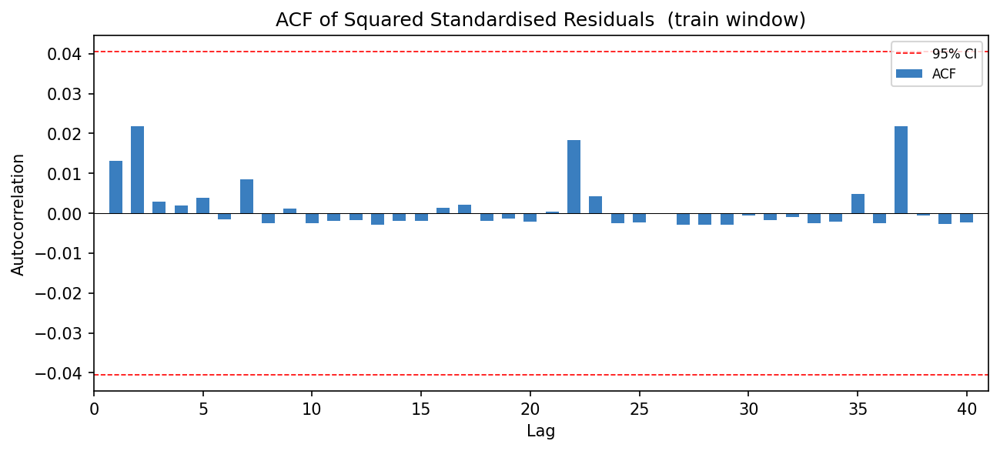
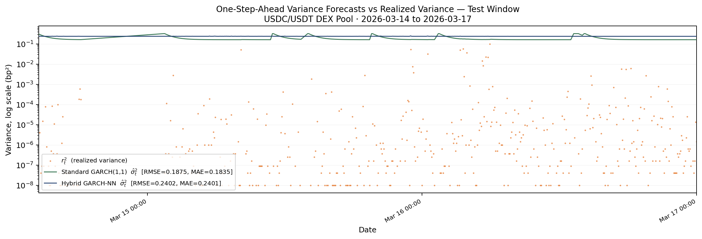
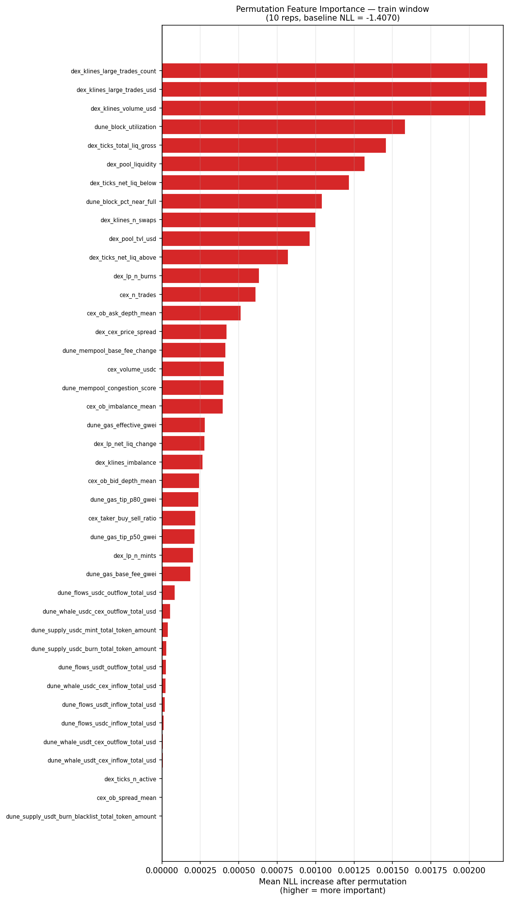
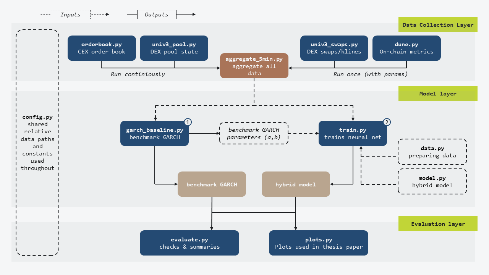

# Hybrid Deep Learning GARCH for Stablecoin Volatility Forecasting

This repository contains the code and analysis for my bachelor's thesis testing whether a feedforward neural network conditioned on market microstructure variables improves short-term stablecoin volatility forecasts over a standard GARCH(1,1) benchmark.

The main result: the 12-day USDC/USDT sample shows no statistically significant ARCH effects, rendering both models unidentifiable. Nonetheless, the permutation feature importance still recovers a theoretically coherent hierarchy of price-impact and arbitrage-friction signals.

Currently, I am rerunning the model on a different, larger timeframe, and potentially a different coin pair.

Author: **Edward Kaminsky**

> Companion reading: 📄 [Thesis paper](papers/thesis.pdf) · 📓 [Data diagnosis notebook](notebooks/diagnostic_test.ipynb) (for statistical evidence) · 📝 [Postmortem](POSTMORTEM.md) (for a discussion of limitations) · 🔁 [Rerun Log](RERUN_LOG.md) (Up-to-date log of the rerun)

---

## TL;DR
A feedforward neural network was conditioned on 41 microstructure features spanning CEX order book data, DEX swap/liquidity activity, and on-chain signals to dynamically adjust GARCH(1,1) parameters with the underlying market state. Over the 12-day USDC/USDT sample (March 2026), the data showed no statistically significant ARCH effects, leaving neither the benchmark nor the hybrid model identifiable. Permutation feature importance nonetheless recovered a coherent hierarchy: execution-side signals (DEX large trade activity, trading volume, block utilization, and liquidity concentration) ranked highest, consistent with the price-impact and arbitrage-friction mechanisms the thesis develops.

## Motivation
Stablecoins, especially those pegged to fiat currencies, are supposed to be perfectly stable and are thus treated as the de facto equivalent of cash across the cryptocurrency ecosystem. In reality, even the most stable stablecoins drift from parity continuously throughout the day, even without any economic shocks. 

This project tests whether that drift is structural, driven by how the market and the asset itself are built rather than by any underlying news or sentiment. I examine three dimensions of the market: **centralized exchanges**, which match orders off-chain through limit order books; **decentralized exchanges**, which price trades on-chain through smart contracts and liquidity pools; and the **blockchain** itself, where gas costs, network congestion, and cross-venue arbitrage delay slow down the corrections that would otherwise close the gap. Supply is structural too: parity is defended through minting and redemption, not a fixed token count, so issuance and burning are tracked as a further candidate for inducing volatility. 

If market structure is the real driver, a neural network conditioned on these frictions should be able to learn it and should outperform a standard GARCH model that relies on price history alone.

## Repository structure

```text
bachelors-thesis-hybrid-deep-learning-garch/
├── README.md                       <-- you are here
├── POSTMORTEM.md                   <-- Limitations, lessons and next steps
├── RERUN_LOG.md                    <-- Log of the current rerun
├── LICENSE
├── requirements.txt
├── code/                           <-- data pipeline, model, evaluation
│   ├── data/                       <-- CEX/DEX/on-chain fetchers + cleaning
│   ├── model/                      <-- GARCH benchmark + hybrid NN; train.py also triggers evaluation/evaluate.py
│   └── evaluation/                 <-- metrics, plotting
├── notebooks/
│   └── diagnostic_test.ipynb       <-- ARCH-LM, Ljung-Box, ACF diagnostics
├── figures/                        <-- result plots referenced below
└── papers/
    └── thesis.pdf                  <-- full writeup
```

## Data
I use the USDC/USDT pair, since both tokens are denominated in US dollars, backed by deep reserve pools, and built on Ethereum, basically comparing the same currency printed in different factories. Since there is no real exchange rate behind a dollar-stablecoin against another dollar-stablecoin, the conditional mean for the return series is genuinely zero rather than something to estimate, so every observed return can be treated directly as the volatility signal.

Data is collected at 5-minute intervals, following Andersen and Bollerslev ([1997](https://doi.org/10.1016/S0927-5398(97)00004-2), [1998](https://doi.org/10.2307/2527343)), over 12 days in March 2026. CEX data comes from Binance, DEX data from Uniswap v3 via The Graph, and on-chain data from Dune Analytics. After cleaning and adjusting for collection gaps, the final return series contains 2,919 observations.

For collection and cleaning detail, see **Chapter 4** of the [thesis](papers/thesis.pdf); for the gap-handling story specifically, see the [postmortem](POSTMORTEM.md).


## Model
On the surface, my model is a GARCH(1,1) model with a short-run parameter **α** and a long-run parameter **β**. The deep learning component is a feedforward neural network with two hidden layers of 32 neurons each, whose purpose is to make α and β time-varying/market-state varying. The hybrid model is trained on the same loss function as the benchmark, the negative log-likelihood of a Gaussian, so any difference in performance reflects the architecture rather than a different objective.

The NN takes 41 microstructural inputs and returns two sigmoids for α<sub>t</sub> and β<sub>t</sub>. Worth noting: I first tried constraining the outputs with softmax so that α + β would stay just below 1. This forces the two parameters into a zero-sum relationship, since increasing one necessarily decreases the other, which is not how shock reactivity and volatility persistence should behave independently. In practice this collapsed to α ≈ 0.999 and β ≈ 0 regardless of training settings, so I switched to two independent sigmoids instead.

More detail on model architecture can be found in Chapters 6.1 and 6.2 of the [thesis](papers/thesis.pdf). Furthermore, the choice of feedforward as the model architecture, the benefits and issues in using sigmoid over softmax, and how the model is constrained by the underlying data are explored in the [postmortem](POSTMORTEM.md).

## Results
The central finding is that the 12-day sample contains no statistically significant ARCH effects, which is what made both GARCH models unidentifiable. This is explored in detail in the [diagnostic tests notebook](notebooks/diagnostic_test.ipynb).



*All 40 lags of the squared standardized residuals fall within the 95% confidence band, confirming no remaining ARCH effects to model.*

As a direct consequence, neither model is identifiable on this data; there is no meaningful ARCH signal for either to fit. The two models fail differently: the benchmark GARCH(1,1) drifts toward a near-integrated process, overreacting to every shock, while the hybrid model's parameters collapse toward zero, producing near-constant variance. Neither resembles the white noise the data actually shows.



*Both forecasts diverge sharply from realized variance (note: the scatter sits 2-8 orders of magnitude below the forecast lines on this log scale, a function of how small the absolute variances are, not a missed volatility spike).*

Despite the parameter collapse, permutation feature importance recovers a hierarchy consistent with the price-impact and arbitrage-friction mechanisms developed in Chapters 2 and 3 of the [thesis](papers/thesis.pdf): large DEX trades, which consume a larger share of pool liquidity and therefore move price more (Section 3.2.1), and high block utilization, which delays cross-venue arbitrage (Section 3.3), both rank highly. Supply-side variables (minting, burning, transfers) rank near zero, though this is likely a function of how few such events occurred in a 12-day window rather than a meaningful absence of signal.



*Execution-side variables dominate the ranking; on-chain supply variables contribute almost nothing.*

## Methodological notes
Below are notes on the methodology that address the most likely first concerns about the correctness and trustworthiness of these results, without needing to dive into the code: 
- **Scaler fit on training split only.** All 41 input features are normalized using statistics computed exclusively from the training window, then applied unchanged to validation and test. No information from later periods leaks into how earlier data is represented.
- **Chronological 70/10/20 split, no shuffling.** Train, validation, and test windows are split in time order, not randomly. The GARCH variance recursion is sequential (σ²ₜ depends on σ²ₜ₋₁), so shuffling observations would corrupt that dependency structure.
- **Variance is positive by construction.** α<sub>t</sub> and β<sub>t</sub> are passed through independent sigmoids scaled to (0, 2α̂) and (0, 2β̂), where α̂ and β̂ are the benchmark GARCH(1,1)'s estimated parameters. Scaling by 2 means an untrained network (sigmoid(0) = 0.5) recovers the benchmark's estimates exactly as its starting prior. This differs from the fixed bounds used in the thesis, since the benchmark GARCH also produced incorrect estimates; see the [postmortem](POSTMORTEM.md) for more.
- **Same NLL objective as the benchmark.** Both the GARCH(1,1) benchmark and the hybrid model are trained by minimizing the identical Gaussian negative log-likelihood, so any difference in performance reflects the architecture, not a different optimization target.

## Reproducing

1. Clone the repo and create a virtual environment.
```bash
   git clone https://github.com/ekaminsk/bachelors-thesis-hybrid-deep-learning-garch.git
   cd bachelors-thesis-hybrid-deep-learning-garch
   python -m venv venv
   source venv/bin/activate  # venv\Scripts\activate on Windows
```

2. Install dependencies.
```bash
   pip install -r requirements.txt
```

3. Copy `.env.example` to `.env` and fill in your own API credentials (The Graph, Dune Analytics).
```bash
   cp .env.example .env
```

4. Collect the data. The four fetchers in `code/data/` can run in any order:
```bash
   python code/data/orderbook.py
   python code/data/univ3_pool.py
   python code/data/univ3_swaps.py
   python code/data/dune.py
```
   Then aggregate into the 5-minute panel used for modeling:
```bash
   python code/data/aggregate_5min.py
```
   This produces `collected_data/final/aggregated_5min_data.csv`.

5. Train and evaluate the models. The benchmark must run first, since its estimated parameters set the sigmoid bounds for the hybrid model's training:
```bash
   python code/model/garch_baseline.py
   python code/model/train.py
   # python code/evaluation/evaluate.py            # already triggered automatically by train.py - optional standalone rerun
   python code/evaluation/plots.py
```

6. (Optional) Explore the diagnostics directly:
```bash
   jupyter notebook notebooks/diagnostic_test.ipynb
```

Figures generated from a fresh run are saved to `/model_results/plots`. The `figures/` folder contains the sample figures referenced throughout this README.
> **Note on Dune Analytics credits:** Query 2 (CEX inflows/outflows) is very large. Free-tier Dune credits may not cover more than roughly 12 days of data in a single billing period. If you're rerunning this on a longer sample, consider narrowing query 2's scope or splitting the collection across multiple months.

The full data and script dependency graph, including which modules are called internally versus run directly:



## Limitations
The following are some of the limitations and considerations about the results, data, and model architecture. The full, extensive discussion of limitations and possible improvements is left to the [postmortem](POSTMORTEM.md) and Chapter 6.4 of the [thesis](papers/thesis.pdf):
- **The sample size does not have sufficient depth.** The USDC/USDT pair traded especially calmly during the collection window, which is why returns are essentially white noise. A larger sample is necessary both to capture episodes of peg stress and elevated trading activity and to give the deep learning model enough data to train on: by the rule of thumb of 10 observations per parameter, roughly 25,000 observations would be needed.
- **Data gaps make LSTM or other memory-based models impractical.** Connection interruptions left 23 gaps of varying size in the data. An architecture that relies on a past hidden state cannot be safely applied across data with gaps this frequent, even though LSTM models have been used in most comparable studies.
- **The USDC/USDT pair might be too stable.** There is a good chance that using two US dollar-denominated stablecoins, both backed by asset pools holding billions, leads to volatility so minor that ARCH effects are essentially impossible to find. At the time of writing, I am not aware of other papers using USDC/USDT specifically for volatility estimation.


## Citation
```bibtex
@mastersthesis{Kaminsky2026,
  title        = {Hybrid Deep Learning GARCH Models for Stablecoin Volatility Forecasting},
  author       = {Kaminsky, Edward},
  year         = {2026},
  type         = {Bachelor's thesis},
  school       = {Peking University and University of Mannheim},
  note         = {Dual-degree program},
  url          = {https://github.com/ekaminsk/bachelors-thesis-hybrid-deep-learning-garch/blob/main/papers/thesis.pdf},
  language     = {en}
}
```

## Licence
See [LICENSE](LICENSE)


## Acknowledgements
This thesis has been supervised by Professor LI Feng (李丰) of the Guanghua School of Management, Department of Business Statistics and Econometrics. Thank you, Professor, for your help and advice on this thesis.

Special thanks also go out to my amazing girlfriend, who has supported me throughout these last years. Thank you for listening to my rambling and helping me understand my crazy ideas and for always being there and supporting me.